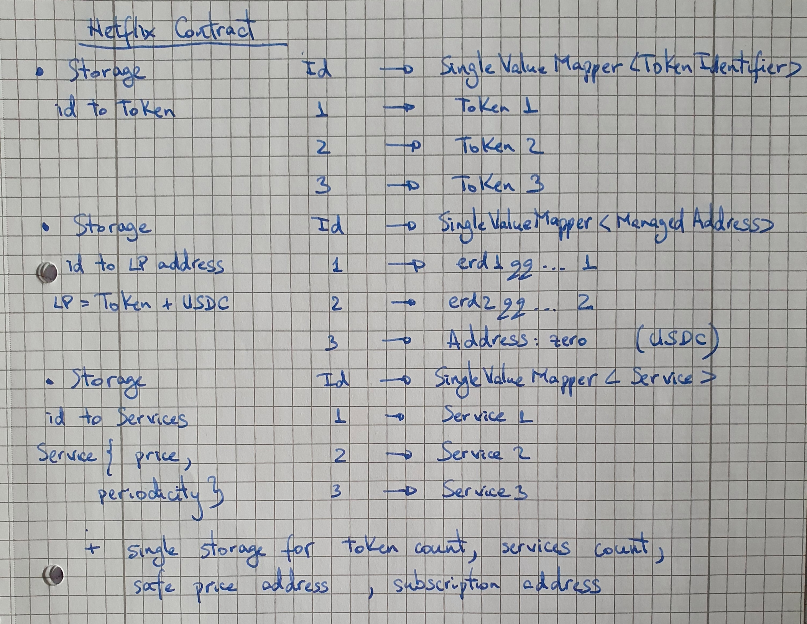

## Netflix Smart Contract


### Features 
* #### Smart contract owner can:
    + Add allowed payment tokens (```addToken```)
    + Add services (```addService```)  
    + Get tokens as payment for the services that a contract subscribed to (```getSubscriptionsTokens```) 

* #### Architecture:

 